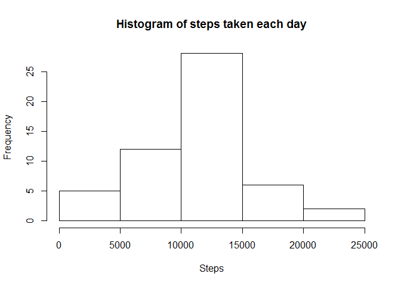
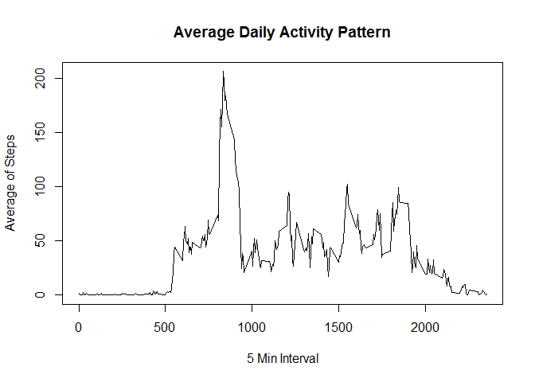
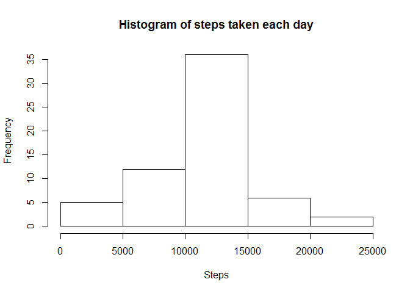
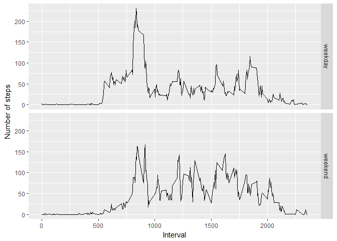

# Reproducible Research: Peer Assessment 1
CHEN Zelin  


## Loading and preprocessing the data


```r
unzip("activity.zip")
activity <- read.csv("activity.csv")
```

## What is mean total number of steps taken per day?

1. Make a histogram of the total number of steps taken each day


```r
library(dplyr)
```

```r
grouped <- group_by(activity, date)
steps.date <- summarise(grouped, steps = sum(steps))
hist(steps.date$steps, main = "Histogram of steps taken each day", xlab = "Steps")
```

<!-- -->

2. Calculate and report the mean and median total number of steps taken per day


```r
mean(steps.date$steps, na.rm = TRUE)
```

```
## [1] 10766.19
```

```r
median(steps.date$steps, na.rm = TRUE)
```

```
## [1] 10765
```

## What is the average daily activity pattern?

1. Make a time series plot of the 5-minute interval (x-axis) and the average number of steps taken, averaged across all days (y-axis)


```r
grouped <- group_by(activity, interval)
steps.interval <- summarise(grouped, steps = mean(steps, na.rm = TRUE))
plot(steps.interval, type = "l", xlab = "5 Min Interval", ylab = "Average of Steps",
     main = "Average Daily Activity Pattern")
```

<!-- -->

2. Which 5-minute interval, on average across all the days in the dataset, contains the maximum number of steps?


```r
steps.interval$interval[which.max(steps.interval$steps)]
```

```
## [1] 835
```

## Imputing missing values

1. Calculate and report the total number of missing values in the dataset (i.e. the total number of rows with NAs)


```r
sum(is.na(activity$steps))
```

```
## [1] 2304
```

2. Devise a strategy for filling in all of the missing values in the dataset.


```r
# Use the means for the 5-minute intervals as fillers for missing values
filler <- function(inter) {
    result <- subset(steps.interval, interval == inter)$steps
}
```

3. Create a new dataset that is equal to the original dataset but with the missing data filled in.


```r
newset <- activity
for(i in 1:length(newset$steps)){
    if (is.na(newset$steps[i])) {
        newset$steps[i] <- filler(newset$interval[i])
    }
}
```


4. Make a histogram of the total number of steps taken each day and Calculate and report the mean and median total number of steps taken per day.


```r
grouped <- group_by(newset, date)
steps.date <- summarise(grouped, steps = sum(steps))
hist(steps.date$steps, main = "Histogram of steps taken each day", xlab = "Steps")
```

<!-- -->


```r
mean(steps.date$steps, na.rm = TRUE)
```

```
## [1] 10766.19
```

```r
median(steps.date$steps, na.rm = TRUE)
```

```
## [1] 10766.19
```

The impact of imputing missing data is rather low.

## Are there differences in activity patterns between weekdays and weekends?

1. Create a new factor variable in the dataset with two levels -- "weekday" and "weekend" indicating whether a given date is a weekday or weekend day.


```r
Systimechange <- Sys.setlocale(category = "LC_ALL", locale = "English")
daytype <- function(date){
    if (weekdays(date) %in% c("Saturday", "Sunday")) {
        "weekend"
    } else {
        "weekday"
    }
}
newset$daytype <- as.factor(sapply(as.Date(newset$date), daytype))
```

2. Make a panel plot containing a time series plot of the 5-minute interval (x-axis) and the average number of steps taken, averaged across all weekday days or weekend days (y-axis).


```r
library(ggplot2)
grouped <- group_by(newset, interval, daytype)
steps.interval <- summarise(grouped, steps = mean(steps, na.rm = TRUE))

ggplot(steps.interval, aes(interval, steps)) + 
geom_line() + 
facet_grid(daytype ~ .) + 
labs(x = "Interval", y = "Number of steps")
```

<!-- -->
